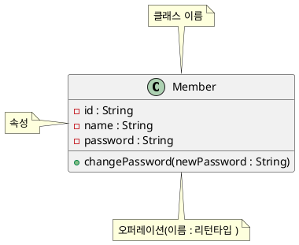
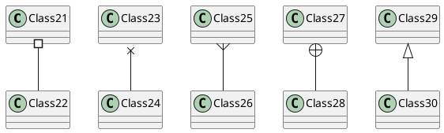
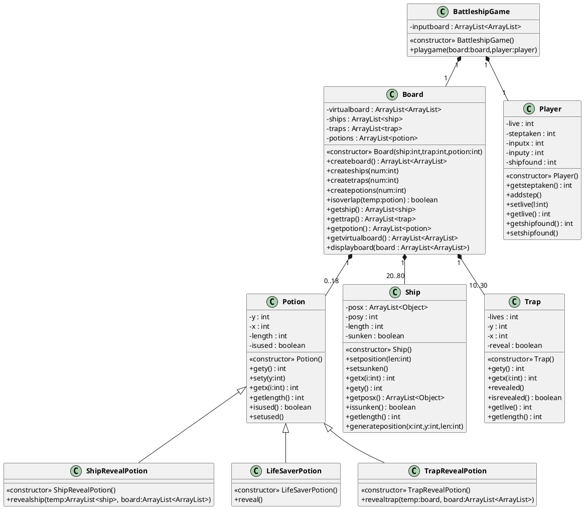
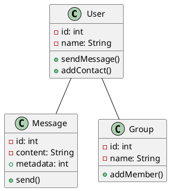

# Class Diagram 
- 객체의 타입 표현
- 객체관의 관계 기술
- 설계 과정(협업) 에서 거의 필수적인 절차 

### 기본 형태 

### 연관관계 나타내기 
대부분의 경우 1:n(n은 2 이상의 정수) 꼴로 나타남. 
따라서 1:n 형태로 많이 나타낸다. 

### Example 

1. BattleShip Game

2. Message
